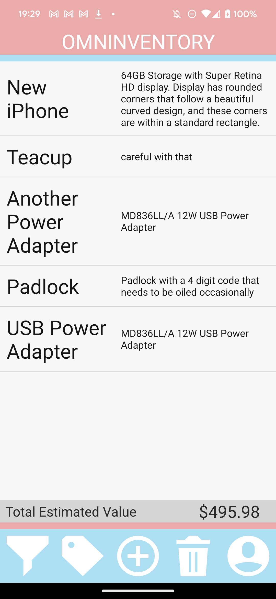
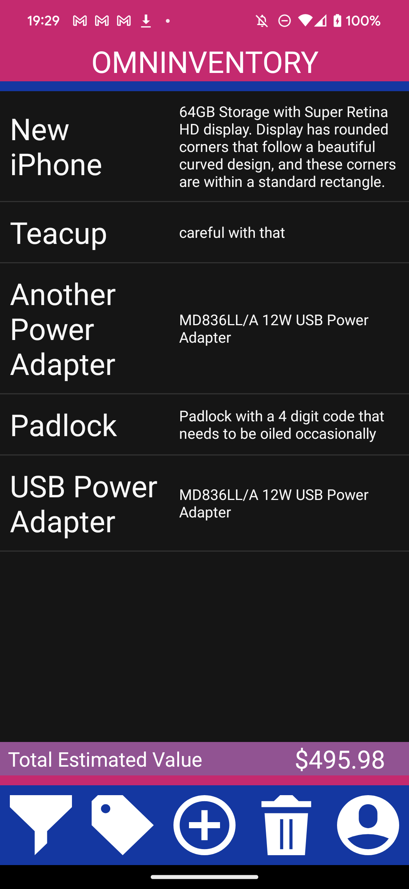

# Omninventory

Our project for CMPUT 301!

## Directory
* The `main` branch contains our project as of Part 4, the final checkpoint.
* The `halfway_point` branch contains our project as of Part 3, the halfway checkpoint.
* All other non-code deliverables and planning can be found in the Wiki for this GitHub repo.

## Group Members
Name | CCID | Github
--- | --- | ---
Aron Gu | agu1 | arongu321
Castor Shem | nshem | castorway
Kevin Huang | xuyang4 | Kevin-was-here
Rose Nguyen | nlnguyen | nlhn
Patrick Harvey | psharvey | PatchyH
Zachary Schmidt | zschmidt | ZacharySchmidt0

## Running FAQ

If you are running the app on an emulator attempt to open the camera to take an image, scan a barcode, or read a serial number, you may see this funny little guy instead of your actual webcam feed.

This is Android's default emulated webcam feed. It is possible to change it to your actual computer webcam (though seemingly not on MacOS):
1. Open Device Manager
2. Edit the device you are using to emulate the app
3. Click 'Show Advanced Settings'
4. Change the front and/or back cameras (whichever you are using) to 'Webcam' instead of 'Emulated'
5. Restart your emulator and relaunch the app.

## Testing FAQ
Tests will only run when done through the android emulator. They will most likely fail of passed on to a physical device due to an unexplainable time that it takes for phone to load up certain views being slower than the tests itself. (There is no hard fix for this problem)

If a test happens to fail, it may cause a series of tests following it to fail due to best practices of automating test cases. :(
To avoid this, when a test and its following test fails Log in to the Tester account. 

Tester Id:Tester
Tester password: Hahah123!